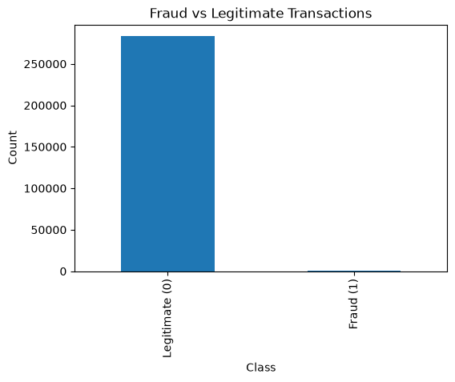
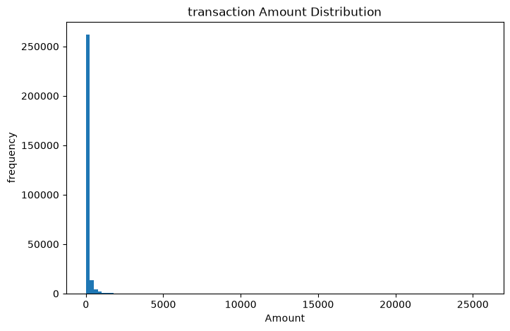
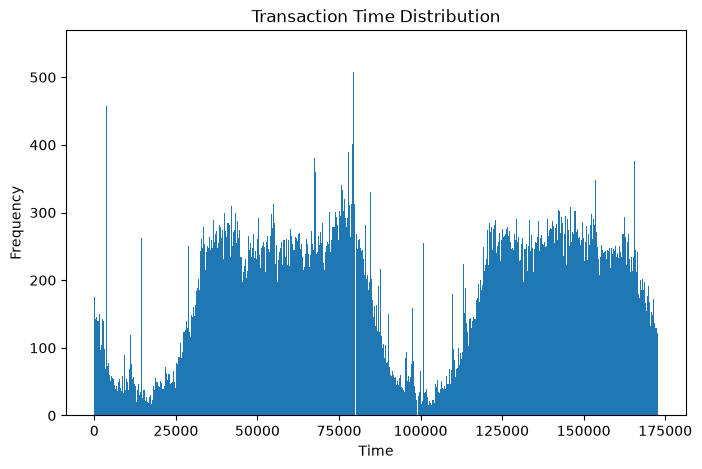
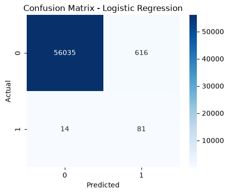
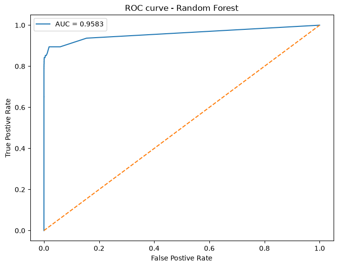
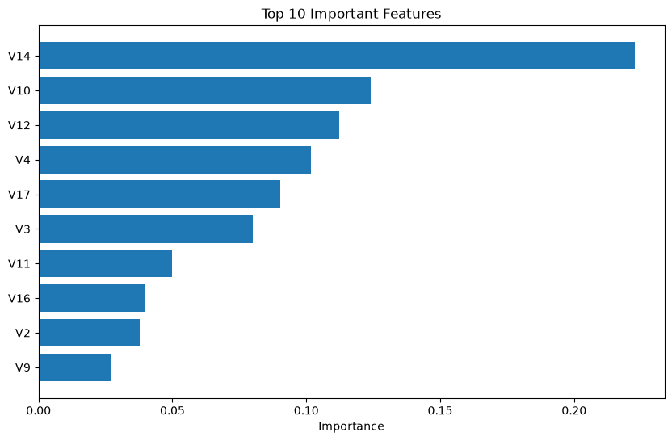

# 💳 Credit Card Fraud Detection using Machine Learning

An end-to-end Machine Learning project that detects fraudulent credit card transactions using supervised learning techniques. This project demonstrates data preprocessing, exploratory data analysis (EDA), handling class imbalance with SMOTE, model training, evaluation, and deployment-ready model serialization.

---

## 📌 Problem Statement

Credit card fraud causes significant financial losses worldwide. Since fraudulent transactions are extremely rare compared to legitimate ones, traditional machine learning models often struggle to identify them accurately.

The objective of this project is to build a robust fraud detection model capable of identifying fraudulent transactions while minimizing false positives.

---

## 🎯 Objectives

- Perform data preprocessing and cleaning
- Analyze transaction patterns using EDA
- Handle class imbalance using SMOTE
- Train multiple machine learning models
- Compare model performance
- Select the best-performing model
- Save the trained model for future predictions

---

## 📂 Dataset

**Dataset:** Credit Card Fraud Detection Dataset

Source:

https://www.kaggle.com/datasets/mlg-ulb/creditcardfraud

Dataset Information:

- 284,807 Transactions
- 31 Columns
- Binary Classification
- Target:
  - 0 → Legitimate
  - 1 → Fraud

**Note:** The dataset is not included in this repository because of GitHub file size limitations.

---

# 🛠 Tech Stack

- Python
- Pandas
- NumPy
- Matplotlib
- Seaborn
- Scikit-learn
- SMOTE
- Joblib
- Jupyter Notebook

---

# 📊 Project Workflow

```
Dataset
    ↓
Data Cleaning
    ↓
Exploratory Data Analysis
    ↓
Feature Scaling
    ↓
SMOTE
    ↓
Train-Test Split
    ↓
Model Building
    ↓
Model Evaluation
    ↓
ROC Curve
    ↓
Feature Importance
    ↓
Model Saving
```

---

# 📈 Exploratory Data Analysis

The following analyses were performed:

- Class Distribution
- Transaction Amount Distribution
- Correlation Heatmap
- Fraud vs Legitimate Analysis

### Class Distribution



---

### Amount Distribution



---


### Time Distribution



---


# 🤖 Machine Learning Models

The following models were trained and evaluated:

- Logistic Regression
- Decision Tree
- Random Forest

Evaluation Metrics:

- Accuracy
- Precision
- Recall
- F1 Score
- ROC-AUC

---

# 📉 Confusion Matrix



---

# 📈 ROC Curve



---

# ⭐ Feature Importance



---

# 📁 Project Structure

```
Credit-Card-Fraud-Detection/
│
├── notebook/
├── images/
├── model/
├── README.md
├── requirements.txt
├── LICENSE
└── .gitignore
```

---

# 🚀 How to Run

Clone the repository

```bash
git clone https://github.com/moogiprasad/Credit-Card-Fraud-Detection.git
```

Install dependencies

```bash
pip install -r requirements.txt
```

Launch Jupyter Notebook

```bash
jupyter notebook
```

Run

```
Fraud_Detection.ipynb
```

---

# 📌 Future Improvements

- Add XGBoost
- Hyperparameter Tuning
- Deploy using Streamlit
- Real-time Fraud Detection API

---

# 💡 Skills Demonstrated

- Data Cleaning
- Exploratory Data Analysis
- Machine Learning
- Data Visualization
- Model Evaluation
- Fraud Detection
- Feature Scaling
- SMOTE
- Model Serialization

---

# 👨‍💻 Author

**Moogi Prasad**

B.Tech Artificial Intelligence & Machine Learning

GitHub: https://github.com/moogiprasad

LinkedIn: https://linkedin.com/in/moogiprasad

---

⭐ If you found this project useful, consider giving it a star!
